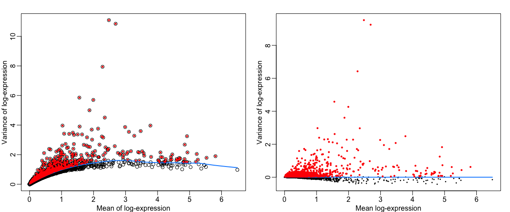
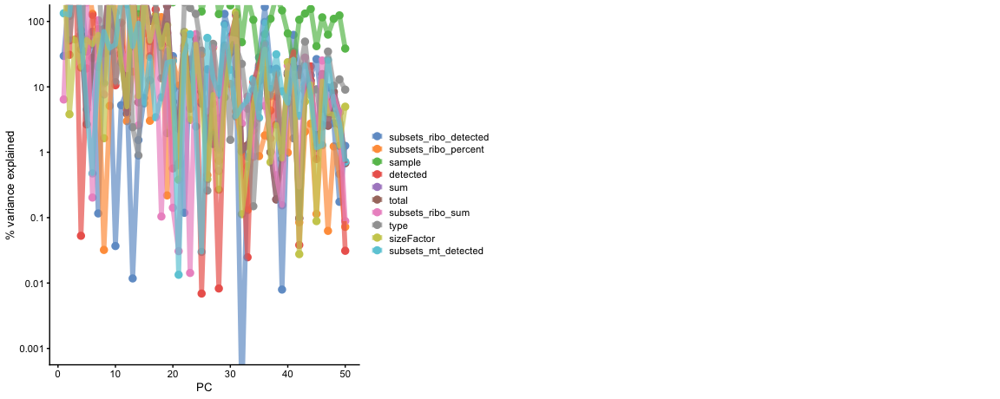
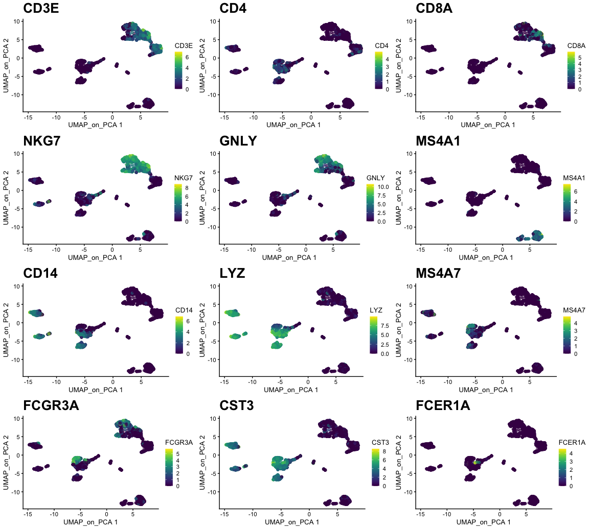

# Dimensionality reduction

Paulo Czarnewski


<style>
h1, .h1, h2, .h2, h3, .h3, h4, .h4 { margin-top: 50px }
p.caption {font-size: 0.9em;font-style: italic;color: grey;margin-right: 10%;margin-left: 10%;text-align: justify}
</style>

## Data preparation
***

First, let's load all necessary libraries and the QC-filtered dataset from the previous step.


```r
suppressPackageStartupMessages({
    library(scater)
    library(scran)
    library(cowplot)
    library(ggplot2)
    library(rafalib)
    library(umap)
})

sce <- readRDS("data/results/covid_qc.rds")
```

### Feature selection

Next, we first need to define which features/genes are important in our dataset to distinguish cell types. For this purpose, we need to find genes that are highly variable across cells, which in turn will also provide a good separation of the cell clusters.


```r
sce <- computeSumFactors(sce, sizes = c(20, 40, 60, 80))
sce <- logNormCounts(sce)
var.out <- modelGeneVar(sce, method = "loess")
hvgs = getTopHVGs(var.out, n = 2000)

mypar(1, 2)
# plot mean over TOTAL variance Visualizing the fit:
fit.var <- metadata(var.out)
plot(fit.var$mean, fit.var$var, xlab = "Mean of log-expression", ylab = "Variance of log-expression")
curve(fit.var$trend(x), col = "dodgerblue", add = TRUE, lwd = 2)

# Select 1000 top variable genes
hvg.out <- getTopHVGs(var.out, n = 1000)

# highligt those cells in the plot
cutoff <- rownames(var.out) %in% hvg.out
points(fit.var$mean[cutoff], fit.var$var[cutoff], col = "red", pch = 16, cex = 0.6)


# plot mean over BIOLOGICAL variance
plot(var.out$mean, var.out$bio, pch = 16, cex = 0.4, xlab = "Mean log-expression",
    ylab = "Variance of log-expression")
lines(c(min(var.out$mean), max(var.out$mean)), c(0, 0), col = "dodgerblue", lwd = 2)
points(var.out$mean[cutoff], var.out$bio[cutoff], col = "red", pch = 16, cex = 0.6)
```

<!-- -->

### Z-score transformation

Now that the data is prepared, we now proceed with PCA. Since each gene has a different expression level, it means that genes with higher expression values will naturally have higher variation that will be captured by PCA. This means that we need to somehow give each gene a similar weight when performing PCA (see below). The common practice is to center and scale each gene before performing PCA. This exact scaling is called Z-score normalization it is very useful for PCA, clustering and plotting heatmaps. <br>Additionally, we can use regression to remove any unwanted sources of variation from the dataset, such as `cell cycle`, `sequencing depth`, `percent mitocondria`. This is achieved by doing a generalized linear regression using these parameters as covariates in the model. Then the residuals of the model are taken as the "regressed data". Although perhaps not in the best way, batch effect regression can also be done here.

By default variables are scaled in the PCA step and is not done separately. But it could be acheieved by running the commads below:


```r
# sce@assays$data@listData$scaled.data <-
# apply(exprs(sce)[rownames(hvg.out),,drop=FALSE],2,function(x) scale(x,T,T))
# rownames(sce@assays$data@listData$scaled.data) <- rownames(hvg.out)
```


## PCA
***

Performing PCA has many useful applications and interpretations, which much depends on the data used. In the case of life sciences, we want to segregate samples based on gene expression patterns in the data.

As said above, we use the `logcounts` and then set `scale_features` to TRUE in order to scale each gene.


```r
# runPCA and specify the variable genes to use for dim reduction with
# subset_row
sce <- runPCA(sce, exprs_values = "logcounts", ncomponents = 50, subset_row = hvg.out,
    scale = TRUE)
```

We then plot the first principal components.


```r
plot_grid(ncol = 3, plotReducedDim(sce, dimred = "PCA", colour_by = "sample", ncomponents = 1:2,
    point_size = 0.6), plotReducedDim(sce, dimred = "PCA", colour_by = "sample",
    ncomponents = 3:4, point_size = 0.6), plotReducedDim(sce, dimred = "PCA", colour_by = "sample",
    ncomponents = 5:6, point_size = 0.6))
```

<!-- -->

To identify which genes (Seurat) or metadata paramters (Scater/Scran) contribute the most to each PC, one can retreive the loading matrix information. Unfortunatelly this is not implemented in Scater/Scran, so you will need to compute PCA using `logcounts`.


```r
plot_grid(ncol = 2, plotExplanatoryPCs(sce))
```

<!-- -->

We can also plot the amount of variance explained by each PC.


```r
mypar()
plot(attr(reducedDim(sce, "PCA"), "percentVar")[1:50] * 100, type = "l", ylab = "% variance",
    xlab = "Principal component #")
points(attr(reducedDim(sce, "PCA"), "percentVar")[1:50] * 100, pch = 21, bg = "grey",
    cex = 0.5)
```

<!-- -->

Based on this plot, we can see that the top 8 PCs retain a lot of information, while other PCs contain pregressivelly less. However, it is still advisable to use more PCs since they might contain informaktion about rare cell types (such as platelets and DCs in this dataset)

## tSNE
***

We can now run [BH-tSNE](https://arxiv.org/abs/1301.3342).


```r
set.seed(42)
sce <- runTSNE(sce, dimred = "PCA", n_dimred = 30, perplexity = 30, name = "tSNE_on_PCA")
```

We can now plot the tSNE colored per dataset. We can clearly see the effect of batches present in the dataset.


```r
plot_grid(ncol = 3, plotReducedDim(sce, dimred = "tSNE_on_PCA", colour_by = "sample"))
```

<!-- -->


## UMAP
***

We can now run [UMAP](https://arxiv.org/abs/1802.03426) for cell embeddings.


```r
sce <- runUMAP(sce, dimred = "PCA", n_dimred = 30, ncomponents = 2, name = "UMAP_on_PCA")
# see ?umap and ?runUMAP for more info
```

Another usefullness of UMAP is that it is not limitted by the number of dimensions the data cen be reduced into (unlike tSNE). We can simply reduce the dimentions altering the `n.components` parameter.


```r
sce <- runUMAP(sce, dimred = "PCA", n_dimred = 30, ncomponents = 10, name = "UMAP10_on_PCA")
# see ?umap and ?runUMAP for more info
```

We can now plot the UMAP colored per dataset. Although less distinct as in the tSNE, we still see quite an effect of the different batches in the data.


```r
plot_grid(ncol = 3, plotReducedDim(sce, dimred = "UMAP_on_PCA", colour_by = "sample") +
    ggplot2::ggtitle(label = "UMAP_on_PCA"), plotReducedDim(sce, dimred = "UMAP10_on_PCA",
    colour_by = "sample", ncomponents = 1:2) + ggplot2::ggtitle(label = "UMAP10_on_PCA"),
    plotReducedDim(sce, dimred = "UMAP10_on_PCA", colour_by = "sample", ncomponents = 3:4) +
        ggplot2::ggtitle(label = "UMAP10_on_PCA"))
```

<!-- -->


## Using ScaledData and graphs for DR
***

Althought running a sencond dimmensionality reduction (i.e tSNE or UMAP) on PCA would be a standard approach (because it allows higher computation efficiency), the options are actually limiteless. Below we will show a couple of other common options such as running directly on the scaled data (which was used for PCA) or on a graph built from scaled data. We will show from now on only UMAP, but the same applies for tSNE.

### Using ScaledData for UMAP

To run tSNE or UMAP on the scaled data, one firts needs to select the number of variables to use. This is because including dimentions that do contribute to the separation of your cell types will in the end mask those differences. Another reason for it is because running with all genes/features also will take longer or might be computationally unfeasible. Therefore we will use the scaled data of the highly variable genes.


```r
sce <- runUMAP(sce, exprs_values = "logcounts", name = "UMAP_on_ScaleData")
```

To run tSNE or UMAP on the a graph, we first need to build a graph from the data. In fact, both tSNE and UMAP first build a graph from the data using a specified distance metrix and then optimize the embedding. Since a graph is just a matrix containing distances from cell to cell and as such, you can run either UMAP or tSNE using any other distance metric desired. Euclidean and Correlation are ususally the most commonly used.

### Using a Graph for UMAP


```r
# Build Graph
nn <- RANN::nn2(reducedDim(sce, "PCA"), k = 30)
names(nn) <- c("idx", "dist")
g <- buildKNNGraph(sce, k = 30, use.dimred = "PCA")
reducedDim(sce, "KNN") <- igraph::as_adjacency_matrix(g)


# Run UMAP and rename it for comparisson temp <- umap::umap.defaults
try(reducedDim(sce, "UMAP_on_Graph") <- NULL)
reducedDim(sce, "UMAP_on_Graph") <- uwot::umap(X = NULL, n_components = 2, nn_method = nn)
```


We can now plot the UMAP comparing both on PCA vs ScaledSata vs Graph.


```r
plot_grid(ncol = 3, plotReducedDim(sce, dimred = "UMAP_on_PCA", colour_by = "sample") +
    ggplot2::ggtitle(label = "UMAP_on_PCA"), plotReducedDim(sce, dimred = "UMAP_on_ScaleData",
    colour_by = "sample") + ggplot2::ggtitle(label = "UMAP_on_ScaleData"), plotReducedDim(sce,
    dimred = "UMAP_on_Graph", colour_by = "sample") + ggplot2::ggtitle(label = "UMAP_on_Graph"))
```

<!-- -->

## Ploting genes of interest
***


Let's plot some marker genes for different celltypes onto the embedding. Some genes are:

Markers	| Cell Type
--- | ---
CD3E	| T cells
CD3E CD4	| CD4+ T cells
CD3E CD8A	| CD8+ T cells
GNLY, NKG7	| NK cells
MS4A1	| B cells
CD14, LYZ, CST3, MS4A7	| CD14+ Monocytes
FCGR3A, LYZ, CST3, MS4A7	| FCGR3A+  Monocytes
FCER1A, CST3 | DCs


```r
plotlist <- list()
for (i in c("CD3E", "CD4", "CD8A", "NKG7", "GNLY", "MS4A1", "CD14", "LYZ", "MS4A7",
    "FCGR3A", "CST3", "FCER1A")) {
    plotlist[[i]] <- plotReducedDim(sce, dimred = "UMAP_on_PCA", colour_by = i, by_exprs_values = "logcounts") +
        scale_fill_gradientn(colours = colorRampPalette(c("grey90", "orange3", "firebrick",
            "firebrick", "red", "red"))(10)) + ggtitle(label = i) + theme(plot.title = element_text(size = 20))
}
plot_grid(ncol = 3, plotlist = plotlist)
```

<!-- -->


We can finally save the object for use in future steps.

<style>
div.blue { background-color:#e6f0ff; border-radius: 5px; padding: 10px;}
</style>
<div class = "blue">
**Your turn**

Select some of your dimensionality reductions and plot some of the QC stats that were calculated in the previous lab. Can you see if some of the separation in your data is driven by quality of the cells?
</div>


```r
saveRDS(sce, "data/results/covid_qc_dm.rds")
```

### Session Info
***


```r
sessionInfo()
```

```
## R version 4.1.3 (2022-03-10)
## Platform: x86_64-apple-darwin13.4.0 (64-bit)
## Running under: macOS Big Sur/Monterey 10.16
## 
## Matrix products: default
## BLAS/LAPACK: /Users/asabjor/miniconda3/envs/scRNAseq2023/lib/libopenblasp-r0.3.21.dylib
## 
## locale:
## [1] C/UTF-8/C/C/C/C
## 
## attached base packages:
## [1] stats4    stats     graphics  grDevices utils     datasets  methods  
## [8] base     
## 
## other attached packages:
##  [1] umap_0.2.9.0                rafalib_1.0.0              
##  [3] cowplot_1.1.1               scran_1.22.1               
##  [5] scater_1.22.0               ggplot2_3.4.0              
##  [7] scuttle_1.4.0               SingleCellExperiment_1.16.0
##  [9] SummarizedExperiment_1.24.0 Biobase_2.54.0             
## [11] GenomicRanges_1.46.1        GenomeInfoDb_1.30.1        
## [13] IRanges_2.28.0              S4Vectors_0.32.4           
## [15] BiocGenerics_0.40.0         MatrixGenerics_1.6.0       
## [17] matrixStats_0.63.0          RJSONIO_1.3-1.7            
## [19] optparse_1.7.3             
## 
## loaded via a namespace (and not attached):
##  [1] bitops_1.0-7              RcppAnnoy_0.0.20         
##  [3] RColorBrewer_1.1-3        tools_4.1.3              
##  [5] bslib_0.4.2               utf8_1.2.2               
##  [7] R6_2.5.1                  irlba_2.3.5.1            
##  [9] vipor_0.4.5               uwot_0.1.14              
## [11] DBI_1.1.3                 colorspace_2.1-0         
## [13] withr_2.5.0               tidyselect_1.2.0         
## [15] gridExtra_2.3             compiler_4.1.3           
## [17] cli_3.6.0                 BiocNeighbors_1.12.0     
## [19] formatR_1.14              DelayedArray_0.20.0      
## [21] labeling_0.4.2            sass_0.4.5               
## [23] scales_1.2.1              askpass_1.1              
## [25] stringr_1.5.0             digest_0.6.31            
## [27] rmarkdown_2.20            XVector_0.34.0           
## [29] pkgconfig_2.0.3           htmltools_0.5.4          
## [31] sparseMatrixStats_1.6.0   highr_0.10               
## [33] fastmap_1.1.0             limma_3.50.3             
## [35] rlang_1.0.6               DelayedMatrixStats_1.16.0
## [37] farver_2.1.1              jquerylib_0.1.4          
## [39] generics_0.1.3            jsonlite_1.8.4           
## [41] BiocParallel_1.28.3       dplyr_1.0.10             
## [43] RCurl_1.98-1.9            magrittr_2.0.3           
## [45] BiocSingular_1.10.0       GenomeInfoDbData_1.2.7   
## [47] Matrix_1.5-3              Rcpp_1.0.10              
## [49] ggbeeswarm_0.7.1          munsell_0.5.0            
## [51] fansi_1.0.4               reticulate_1.27          
## [53] viridis_0.6.2             lifecycle_1.0.3          
## [55] stringi_1.7.12            yaml_2.3.7               
## [57] edgeR_3.36.0              zlibbioc_1.40.0          
## [59] Rtsne_0.16                grid_4.1.3               
## [61] parallel_4.1.3            ggrepel_0.9.2            
## [63] dqrng_0.3.0               lattice_0.20-45          
## [65] beachmat_2.10.0           locfit_1.5-9.7           
## [67] metapod_1.2.0             knitr_1.41               
## [69] pillar_1.8.1              igraph_1.3.5             
## [71] codetools_0.2-18          ScaledMatrix_1.2.0       
## [73] glue_1.6.2                evaluate_0.20            
## [75] png_0.1-8                 vctrs_0.5.2              
## [77] RANN_2.6.1                openssl_2.0.5            
## [79] gtable_0.3.1              getopt_1.20.3            
## [81] assertthat_0.2.1          cachem_1.0.6             
## [83] xfun_0.36                 rsvd_1.0.5               
## [85] RSpectra_0.16-1           viridisLite_0.4.1        
## [87] tibble_3.1.8              beeswarm_0.4.0           
## [89] cluster_2.1.4             bluster_1.4.0            
## [91] statmod_1.5.0
```
