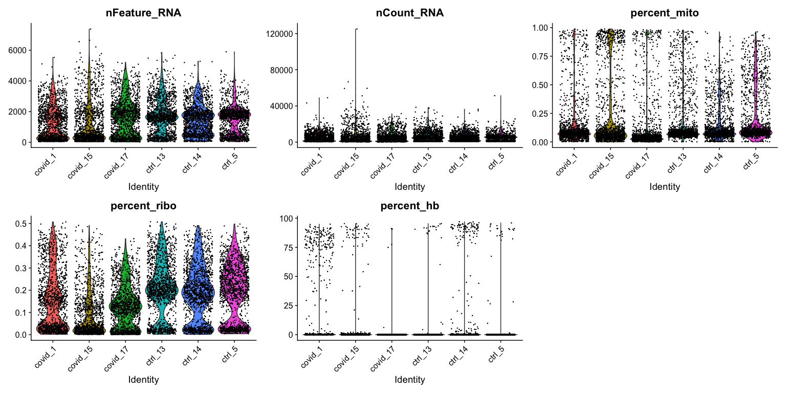
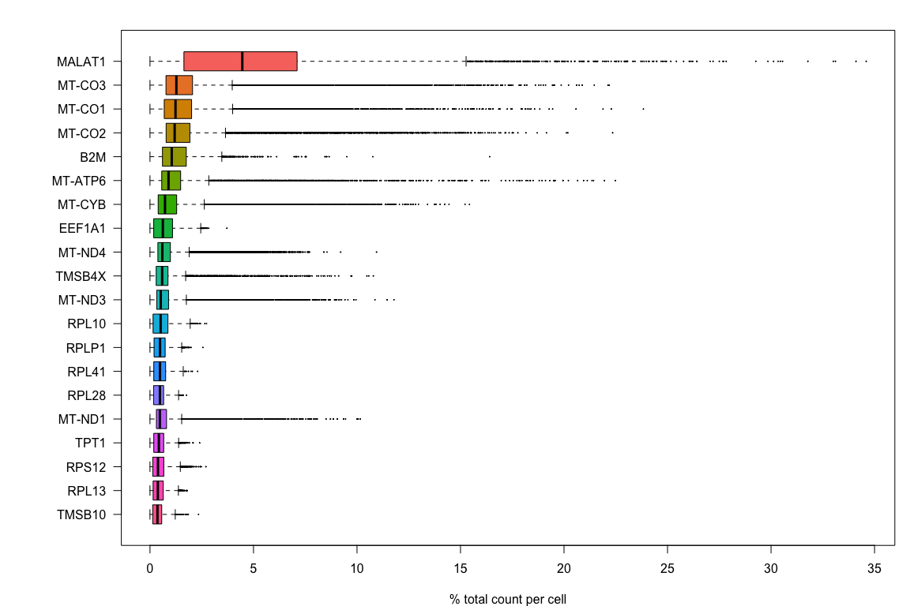
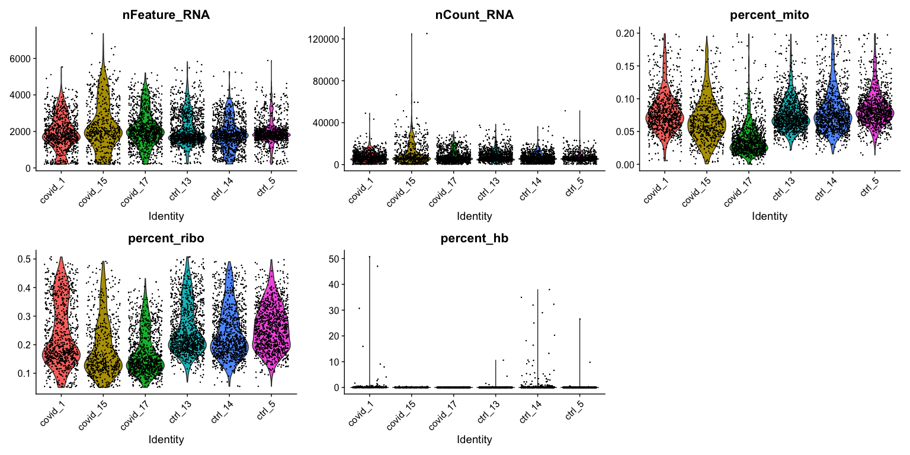
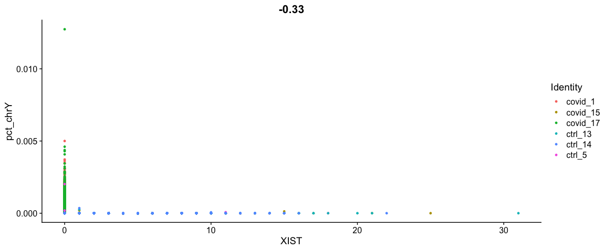
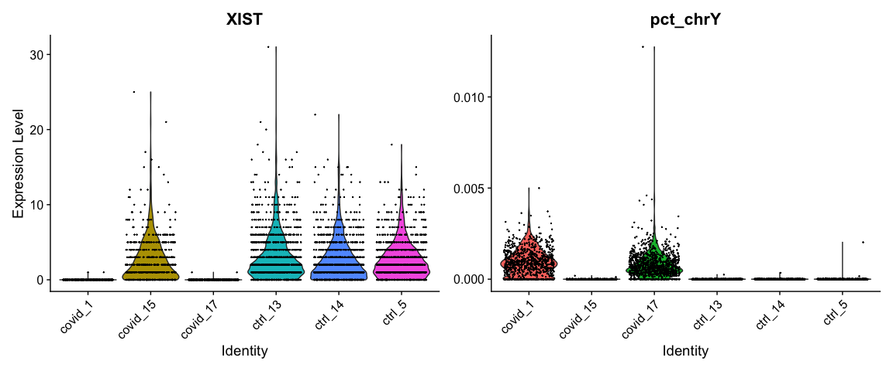
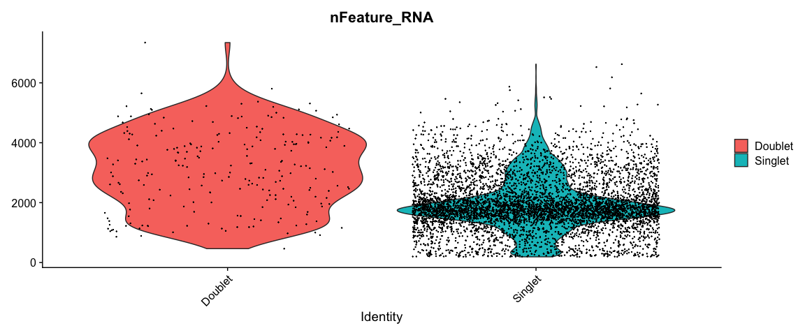

<style>
h1, .h1, h2, .h2, h3, .h3, h4, .h4 { margin-top: 50px }
p.caption {font-size: 0.9em;font-style: italic;color: grey;margin-right: 10%;margin-left: 10%;text-align: justify}
</style>

***
# Get data

In this tutorial, we will run all tutorials with a set of 6 PBMC 10x datasets from 3 covid-19 patients and 3 healthy controls, the samples have been subsampled to 1500 cells per sample. They are part of the github repo and if you have cloned the repo they should be available in folder: `labs/data/covid_data_GSE149689`. Instructions on how to download them can also be found in the Precourse material.


```r
webpath <- "https://raw.githubusercontent.com/NBISweden/workshop-scRNAseq/new_dataset/labs/data/covid_data_GSE149689/sub/"
dir.create("./data/raw", recursive = T)
```

```
## Warning in dir.create("./data/raw", recursive = T): './data/raw' already exists
```

```r
file_list <- c("Normal_PBMC_13.h5", "Normal_PBMC_14.h5", "Normal_PBMC_5.h5", "nCoV_PBMC_15.h5",
    "nCoV_PBMC_17.h5", "nCoV_PBMC_1.h5")
for (i in file_list) {
    download.file(url = paste0(webpath, i), destfile = paste0("./data/raw/", i))
}
```


With data in place, now we can start loading libraries we will use in this tutorial.


```r
suppressMessages(require(Seurat))
suppressMessages(require(Matrix))
if (!require(DoubletFinder)) {
    remotes::install_github("chris-mcginnis-ucsf/DoubletFinder", upgrade = FALSE,
        dependencies = FALSE)
}
```

```
## Loading required package: DoubletFinder
```

```r
suppressMessages(require(DoubletFinder))
```

We can first load the data individually by reading directly from HDF5 file format (.h5).


```r
cov.15 <- Seurat::Read10X_h5(filename = "data/raw/nCoV_PBMC_15.h5", use.names = T)
cov.1 <- Seurat::Read10X_h5(filename = "data/raw/nCoV_PBMC_1.h5", use.names = T)
cov.17 <- Seurat::Read10X_h5(filename = "data/raw/nCoV_PBMC_17.h5", use.names = T)

ctrl.5 <- Seurat::Read10X_h5(filename = "data/raw/Normal_PBMC_5.h5", use.names = T)
ctrl.13 <- Seurat::Read10X_h5(filename = "data/raw/Normal_PBMC_13.h5", use.names = T)
ctrl.14 <- Seurat::Read10X_h5(filename = "data/raw/Normal_PBMC_14.h5", use.names = T)
```

***
# Create one merged object

We can now load the expression matricies into objects and then merge them into a single merged object. Each analysis workflow (Seurat, Scater, Scranpy, etc) has its own way of storing data. We will add dataset labels as cell.ids just in case you have overlapping barcodes between the datasets. After that we add a column `Chemistry` in the metadata for plotting later on.


```r
sdata.cov15 <- CreateSeuratObject(cov.15, project = "covid_15")
sdata.cov1 <- CreateSeuratObject(cov.1, project = "covid_1")
sdata.cov17 <- CreateSeuratObject(cov.17, project = "covid_17")
sdata.ctrl5 <- CreateSeuratObject(ctrl.5, project = "ctrl_5")
sdata.ctrl13 <- CreateSeuratObject(ctrl.13, project = "ctrl_13")
sdata.ctrl14 <- CreateSeuratObject(ctrl.14, project = "ctrl_14")

# add metadata
sdata.cov1$type = "Covid"
sdata.cov15$type = "Covid"
sdata.cov17$type = "Covid"
sdata.ctrl5$type = "Ctrl"
sdata.ctrl13$type = "Ctrl"
sdata.ctrl14$type = "Ctrl"


# Merge datasets into one single seurat object
alldata <- merge(sdata.cov15, c(sdata.cov1, sdata.cov17, sdata.ctrl5, sdata.ctrl13,
    sdata.ctrl14), add.cell.ids = c("covid_15", "covid_1", "covid_17", "ctrl_5",
    "ctrl_13", "ctrl_14"))
```

Once you have created the merged Seurat object, the count matrices and individual count matrices and objects are not needed anymore. It is a good idea to remove them and run garbage collect to free up some memory.


```r
# remove all objects that will not be used.
rm(cov.15, cov.1, cov.17, ctrl.5, ctrl.13, ctrl.14, sdata.cov15, sdata.cov1, sdata.cov17,
    sdata.ctrl5, sdata.ctrl13, sdata.ctrl14)

# run garbage collect to free up memory
gc()
```

```
##            used  (Mb) gc trigger  (Mb)  max used  (Mb)
## Ncells  3386632 180.9    6555255 350.1   6416109 342.7
## Vcells 44790550 341.8  129023968 984.4 102624970 783.0
```
 Here it is how the count matrix and the metatada look like for every cell.


```r
as.data.frame(alldata@assays$RNA@counts[1:10, 1:2])
head(alldata@meta.data, 10)
```

<div data-pagedtable="false">
  <script data-pagedtable-source type="application/json">
{"columns":[{"label":[""],"name":["_rn_"],"type":[""],"align":["left"]},{"label":["covid_15_CTCCATGTCAACGTGT-15"],"name":[1],"type":["dbl"],"align":["right"]},{"label":["covid_15_CATAAGCAGGAACGAA-15"],"name":[2],"type":["dbl"],"align":["right"]}],"data":[{"1":"0","2":"0","_rn_":"MIR1302-2HG"},{"1":"0","2":"0","_rn_":"FAM138A"},{"1":"0","2":"0","_rn_":"OR4F5"},{"1":"0","2":"0","_rn_":"AL627309.1"},{"1":"0","2":"0","_rn_":"AL627309.3"},{"1":"0","2":"0","_rn_":"AL627309.2"},{"1":"0","2":"0","_rn_":"AL627309.4"},{"1":"0","2":"0","_rn_":"AL732372.1"},{"1":"0","2":"0","_rn_":"OR4F29"},{"1":"0","2":"0","_rn_":"AC114498.1"}],"options":{"columns":{"min":{},"max":[10]},"rows":{"min":[10],"max":[10]},"pages":{}}}
  </script>
</div><div data-pagedtable="false">
  <script data-pagedtable-source type="application/json">
{"columns":[{"label":[""],"name":["_rn_"],"type":[""],"align":["left"]},{"label":["orig.ident"],"name":[1],"type":["chr"],"align":["left"]},{"label":["nCount_RNA"],"name":[2],"type":["dbl"],"align":["right"]},{"label":["nFeature_RNA"],"name":[3],"type":["int"],"align":["right"]},{"label":["type"],"name":[4],"type":["chr"],"align":["left"]}],"data":[{"1":"covid_15","2":"14911","3":"3526","4":"Covid","_rn_":"covid_15_CTCCATGTCAACGTGT-15"},{"1":"covid_15","2":"338","3":"203","4":"Covid","_rn_":"covid_15_CATAAGCAGGAACGAA-15"},{"1":"covid_15","2":"28486","3":"4542","4":"Covid","_rn_":"covid_15_TTCACCGTCAGGAAGC-15"},{"1":"covid_15","2":"1318","3":"539","4":"Covid","_rn_":"covid_15_CGTCCATGTCCGGACT-15"},{"1":"covid_15","2":"4805","3":"1493","4":"Covid","_rn_":"covid_15_GTCCACTAGTCGCCCA-15"},{"1":"covid_15","2":"5386","3":"1617","4":"Covid","_rn_":"covid_15_ATCCATTGTTGATGTC-15"},{"1":"covid_15","2":"686","3":"407","4":"Covid","_rn_":"covid_15_AGAAGCGAGGGCCTCT-15"},{"1":"covid_15","2":"2155","3":"1116","4":"Covid","_rn_":"covid_15_GAGGGTAGTAGGTTTC-15"},{"1":"covid_15","2":"1216","3":"128","4":"Covid","_rn_":"covid_15_CAAGACTTCTGCTTTA-15"},{"1":"covid_15","2":"729","3":"356","4":"Covid","_rn_":"covid_15_GCCAACGAGCTCTATG-15"}],"options":{"columns":{"min":{},"max":[10]},"rows":{"min":[10],"max":[10]},"pages":{}}}
  </script>
</div>


***
# Calculate QC

Having the data in a suitable format, we can start calculating some quality metrics. We can for example calculate the percentage of mitocondrial and ribosomal genes per cell and add to the metadata. This will be helpfull to visualize them across different metadata parameteres (i.e. datasetID and chemistry version). There are several ways of doing this, and here manually calculate the proportion of mitochondrial reads and add to the metadata table.

Citing from "Simple Single Cell" workflows (Lun, McCarthy & Marioni, 2017): "High proportions are indicative of poor-quality cells (Islam et al. 2014; Ilicic et al. 2016), possibly because of loss of cytoplasmic RNA from perforated cells. The reasoning is that mitochondria are larger than individual transcript molecules and less likely to escape through tears in the cell membrane."


```r
# Way1: Doing it using Seurat function
alldata <- PercentageFeatureSet(alldata, "^MT-", col.name = "percent_mito")

# Way2: Doing it manually
total_counts_per_cell <- colSums(alldata@assays$RNA@counts)
mito_genes <- rownames(alldata)[grep("^MT-", rownames(alldata))]
alldata$percent_mito <- colSums(alldata@assays$RNA@counts[mito_genes, ])/total_counts_per_cell

head(mito_genes, 10)
```

```
##  [1] "MT-ND1"  "MT-ND2"  "MT-CO1"  "MT-CO2"  "MT-ATP8" "MT-ATP6" "MT-CO3" 
##  [8] "MT-ND3"  "MT-ND4L" "MT-ND4"
```

In the same manner we will calculate the proportion gene expression that comes from ribosomal proteins.


```r
# Way1: Doing it using Seurat function
alldata <- PercentageFeatureSet(alldata, "^RP[SL]", col.name = "percent_ribo")

# Way2: Doing it manually
ribo_genes <- rownames(alldata)[grep("^RP[SL]", rownames(alldata))]
head(ribo_genes, 10)
alldata$percent_ribo <- colSums(alldata@assays$RNA@counts[ribo_genes, ])/total_counts_per_cell
```

```
##  [1] "RPL22"   "RPL11"   "RPS6KA1" "RPS8"    "RPL5"    "RPS27"   "RPS6KC1"
##  [8] "RPS7"    "RPS27A"  "RPL31"
```

And finally, with the same method we will calculate proportion hemoglobin genes, which can give an indication of red blood cell contamination.


```r
# Percentage hemoglobin genes - includes all genes starting with HB except HBP.
alldata <- PercentageFeatureSet(alldata, "^HB[^(P)]", col.name = "percent_hb")

alldata <- PercentageFeatureSet(alldata, "PECAM1|PF4", col.name = "percent_plat")
```

***
# Plot QC

Now we can plot some of the QC-features as violin plots.


```r
feats <- c("nFeature_RNA", "nCount_RNA", "percent_mito", "percent_ribo", "percent_hb")
VlnPlot(alldata, group.by = "orig.ident", features = feats, pt.size = 0.1, ncol = 3) +
    NoLegend()
```

<!-- -->

As you can see, there is quite some difference in quality for the 4 datasets, with for instance the covid_15 sample having fewer cells with many detected genes and more mitochondrial content. As the ribosomal proteins are highly expressed they will make up a larger proportion of the transcriptional landscape when fewer of the lowly expressed genes are detected. And we can plot the different QC-measures as scatter plots.


```r
FeatureScatter(alldata, "nCount_RNA", "nFeature_RNA", group.by = "orig.ident", pt.size = 0.5)
```

<!-- -->

<style>
div.blue { background-color:#e6f0ff; border-radius: 5px; padding: 10px;}
</style>
<div class = "blue">
**Your turn**

Plot additional QC stats that we have calculated as scatter plots. How are the different measures correlated? Can you explain why?
</div>

***
# Filtering

## Detection-based filtering

A standard approach is to filter cells with low amount of reads as well as genes that are present in at least a certain amount of cells. Here we will only consider cells with at least 200 detected genes and genes need to be expressed in at least 3 cells. Please note that those values are highly dependent on the library preparation method used.


```r
selected_c <- WhichCells(alldata, expression = nFeature_RNA > 200)
selected_f <- rownames(alldata)[Matrix::rowSums(alldata) > 3]

data.filt <- subset(alldata, features = selected_f, cells = selected_c)
dim(data.filt)
```

```
## [1] 18147  7973
```

 Extremely high number of detected genes could indicate doublets. However, depending on the cell type composition in your sample, you may have cells with higher number of genes (and also higher counts) from one cell type. <br>In this case, we will run doublet prediction further down, so we will skip this step now, but the code below is an example of how it can be run:


```r
# skip for now and run DoubletFinder first!

# high.det.v3 <- WhichCells(data.filt, expression = nFeature_RNA > 4100)
# high.det.v2 <- WhichCells(data.filt, expression = nFeature_RNA > 2000 &
# orig.ident == 'v2.1k')

# remove these cells data.filt <- subset(data.filt,
# cells=setdiff(WhichCells(data.filt),c(high.det.v2,high.det.v3)))

# check number of cells
ncol(data.filt)
```

```
## [1] 7973
```

Additionally, we can also see which genes contribute the most to such reads. We can for instance plot the percentage of counts per gene.


```r
# Compute the relative expression of each gene per cell Use sparse matrix
# operations, if your dataset is large, doing matrix devisions the regular way
# will take a very long time.
par(mar = c(4, 8, 2, 1))
C <- data.filt@assays$RNA@counts
C <- Matrix::t(Matrix::t(C)/Matrix::colSums(C)) * 100
most_expressed <- order(apply(C, 1, median), decreasing = T)[20:1]
```

```
## Warning in asMethod(object): sparse->dense coercion: allocating vector of size
## 1.1 GiB
```

```r
boxplot(as.matrix(t(C[most_expressed, ])), cex = 0.1, las = 1, xlab = "% total count per cell",
    col = (scales::hue_pal())(20)[20:1], horizontal = TRUE)
```

<!-- -->

As you can see, MALAT1 constitutes up to 30% of the UMIs from a single cell and the other top genes are mitochondrial and ribosomal genes. It is quite common that nuclear lincRNAs have correlation with quality and mitochondrial reads, so high detection of MALAT1 may be a technical issue. Let us assemble some information about such genes, which are important for quality control and downstream filtering.

## Mito/Ribo filtering

We also have quite a lot of cells with high proportion of mitochondrial and low proportion ofribosomal reads. It could be wise to remove those cells, if we have enough cells left after filtering. <br>Another option would be to either remove all mitochondrial reads from the dataset and hope that the remaining genes still have enough biological signal. <br>A third option would be to just regress out the `percent_mito` variable during scaling. In this case we had as much as 99.7% mitochondrial reads in some of the cells, so it is quite unlikely that there is much cell type signature left in those. <br>Looking at the plots, make reasonable decisions on where to draw the cutoff. In this case, the bulk of the cells are below 20% mitochondrial reads and that will be used as a cutoff. We will also remove cells with less than 5% ribosomal reads.


```r
selected_mito <- WhichCells(data.filt, expression = percent_mito < 0.2)
selected_ribo <- WhichCells(data.filt, expression = percent_ribo > 0.05)

# and subset the object to only keep those cells
data.filt <- subset(data.filt, cells = selected_mito)
data.filt <- subset(data.filt, cells = selected_ribo)

dim(data.filt)

table(data.filt$orig.ident)
```

```
## [1] 18147  5762
## 
##  covid_1 covid_15 covid_17  ctrl_13  ctrl_14   ctrl_5 
##      878      585     1042     1154     1063     1040
```

 As you can see, a large proportion of sample covid_15 is filtered out. Also, there is still quite a lot of variation in `percent_mito`, so it will have to be dealt with in the data analysis step. We can also notice that the `percent_ribo` are also highly variable, but that is expected since different cell types have different proportions of ribosomal content, according to their function.

## Plot filtered QC

Lets plot the same QC-stats another time.


```r
feats <- c("nFeature_RNA", "nCount_RNA", "percent_mito", "percent_ribo", "percent_hb")

VlnPlot(data.filt, group.by = "orig.ident", features = feats, pt.size = 0.1, ncol = 3) +
    NoLegend()
```

<!-- -->

## Filter genes

As the level of expression of mitochondrial and MALAT1 genes are judged as mainly technical, it can be wise to remove them from the dataset bofore any further analysis.


```r
dim(data.filt)

# Filter MALAT1
data.filt <- data.filt[!grepl("MALAT1", rownames(data.filt)), ]

# Filter Mitocondrial
data.filt <- data.filt[!grepl("^MT-", rownames(data.filt)), ]

# Filter Ribossomal gene (optional if that is a problem on your data) data.filt
# <- data.filt[ ! grepl('^RP[SL]', rownames(data.filt)), ]

# Filter Hemoglobin gene (optional if that is a problem on your data)
data.filt <- data.filt[!grepl("^HB[^(P)]", rownames(data.filt)), ]

dim(data.filt)
```

```
## [1] 18147  5762
## [1] 18121  5762
```


# Sample sex

When working with human or animal samples, you should ideally constrain you experiments to a single sex to avoid including sex bias in the conclusions. However this may not always be possible. By looking at reads from chromosomeY (males) and XIST (X-inactive specific transcript) expression (mainly female) it is quite easy to determine per sample which sex it is. It can also bee a good way to detect if there has been any sample mixups, if the sample metadata sex does not agree with the computational predictions.

To get choromosome information for all genes, you should ideally parse the information from the gtf file that you used in the mapping pipeline as it has the exact same annotation version/gene naming. However, it may not always be available, as in this case where we have downloaded public data. Hence, we will use biomart to fetch chromosome information. 
As the biomart instances quite often are unresponsive, you can try the code below, but if it fails, we have the file with gene annotations on github [here](https://raw.githubusercontent.com/NBISweden/workshop-scRNAseq/labs/misc/genes.table.csv). Make sure you put it at the correct location for the path `genes.file` to work. 


```r
genes.file = "data/results/genes.table.csv"

if (!file.exists(genes.file)) {
    suppressMessages(require(biomaRt))

    # initialize connection to mart, may take some time if the sites are
    # unresponsive.
    mart <- useMart("ENSEMBL_MART_ENSEMBL", dataset = "hsapiens_gene_ensembl")

    # fetch chromosome info plus some other annotations
    genes.table <- try(biomaRt::getBM(attributes = c("ensembl_gene_id", "external_gene_name",
        "description", "gene_biotype", "chromosome_name", "start_position"), mart = mart,
        useCache = F))

    if (!dir.exists("data/results")) {
        dir.create("data/results")
    }
    if (is.data.frame(genes.table)) {
        write.csv(genes.table, file = genes.file)
    }

    if (!file.exists(genes.file)) {
        download.file("https://raw.githubusercontent.com/NBISweden/workshop-scRNAseq/master/labs/misc/genes.table.csv",
            destfile = "data/results/genes.table.csv")
        genes.table = read.csv(genes.file)
    }

} else {
    genes.table = read.csv(genes.file)
}

genes.table <- genes.table[genes.table$external_gene_name %in% rownames(data.filt),
    ]
```

Now that we have the chromosome information, we can calculate per cell the proportion of reads that comes from chromosome Y.


```r
chrY.gene = genes.table$external_gene_name[genes.table$chromosome_name == "Y"]

data.filt$pct_chrY = colSums(data.filt@assays$RNA@counts[chrY.gene, ])/colSums(data.filt@assays$RNA@counts)
```

Then plot XIST expression vs chrY proportion. As you can see, the samples are clearly on either side, even if some cells do not have detection of either.


```r
FeatureScatter(data.filt, feature1 = "XIST", feature2 = "pct_chrY")
```

<!-- -->

Plot as violins.


```r
VlnPlot(data.filt, features = c("XIST", "pct_chrY"))
```

<!-- -->

Here, we can see clearly that we have two males and 4 females, can you see which samples they are? 
Do you think this will cause any problems for downstream analysis? Discuss with your group: what would be the best way to deal with this type of sex bias?


# Calculate cell-cycle scores

We here perform cell cycle scoring. To score a gene list, the algorithm calculates the difference of mean expression of the given list and the mean expression of reference genes. To build the reference, the function randomly chooses a bunch of genes matching the distribution of the expression of the given list. Cell cycle scoring adds three slots in data, a score for S phase, a score for G2M phase and the predicted cell cycle phase.


```r
# Before running CellCycleScoring the data need to be normalized and
# logtransformed.
data.filt = NormalizeData(data.filt)


data.filt <- CellCycleScoring(object = data.filt, g2m.features = cc.genes$g2m.genes,
    s.features = cc.genes$s.genes)
```

```
## Warning: The following features are not present in the object: MLF1IP, not
## searching for symbol synonyms
```

```
## Warning: The following features are not present in the object: FAM64A, HN1, not
## searching for symbol synonyms
```

We can now plot a violin plot for the cell cycle scores as well.


```r
VlnPlot(data.filt, features = c("S.Score", "G2M.Score"), group.by = "orig.ident",
    ncol = 4, pt.size = 0.1)
```

<!-- -->

In this case it looks like we only have a few cycling cells in the datasets.


# Predict doublets

Doublets/Mulitples of cells in the same well/droplet is a common issue in scRNAseq protocols. Especially in droplet-based methods whith overloading of cells. In a typical 10x experiment the proportion of doublets is linearly dependent on the amount of loaded cells. As  indicated from the Chromium user guide, doublet rates are about as follows:

Most doublet detectors simulates doublets by merging cell counts and predicts doublets as cells that have similar embeddings as the simulated doublets. Most such packages need an assumption about the number/proportion of expected doublets in the dataset. The data you are using is subsampled, but the orignial datasets contained about 5 000 cells per sample, hence we can assume that they loaded about 9 000 cells and should have a doublet rate at about 4%.

**OBS!** Ideally doublet prediction should be run on each sample separately, especially if your different samples have different proportions of celltypes. In this case, the data is subsampled so we have very few cells per sample and all samples are sorted PBMCs so it is okay to run them together.

Here, we will use `DoubletFinder` to predict doublet cells. But before doing doublet detection we need to run scaling, variable gene selection and pca, as well as UMAP for visualization. These steps will be explored in more detail in coming exercises.


```r
suppressMessages(require(DoubletFinder))

data.filt = FindVariableFeatures(data.filt, verbose = F)
data.filt = ScaleData(data.filt, vars.to.regress = c("nFeature_RNA", "percent_mito"),
    verbose = F)
data.filt = RunPCA(data.filt, verbose = F, npcs = 20)
data.filt = RunUMAP(data.filt, dims = 1:10, verbose = F)
```

Then we run doubletFinder, selecting first 10 PCs and a pK value of 0.9. To optimize the parameters, you can run the `paramSweep` function in the package.


```r
# Can run parameter optimization with paramSweep

# sweep.res <- paramSweep_v3(data.filt) sweep.stats <-
# summarizeSweep(sweep.res, GT = FALSE) bcmvn <- find.pK(sweep.stats)
# barplot(bcmvn$BCmetric, names.arg = bcmvn$pK, las=2)

# define the expected number of doublet cellscells.
nExp <- round(ncol(data.filt) * 0.04)  # expect 4% doublets
data.filt <- doubletFinder_v3(data.filt, pN = 0.25, pK = 0.09, nExp = nExp, PCs = 1:10)
```

```
## [1] "Creating 1921 artificial doublets..."
## [1] "Creating Seurat object..."
## [1] "Normalizing Seurat object..."
## [1] "Finding variable genes..."
## [1] "Scaling data..."
## [1] "Running PCA..."
## [1] "Calculating PC distance matrix..."
## [1] "Computing pANN..."
## [1] "Classifying doublets.."
```


```r
# name of the DF prediction can change, so extract the correct column name.
DF.name = colnames(data.filt@meta.data)[grepl("DF.classification", colnames(data.filt@meta.data))]


cowplot::plot_grid(ncol = 2, DimPlot(data.filt, group.by = "orig.ident") + NoAxes(),
    DimPlot(data.filt, group.by = DF.name) + NoAxes())
```

<!-- -->


We should expect that two cells have more detected genes than a single cell, lets check if our predicted doublets also have more detected genes in general.


```r
VlnPlot(data.filt, features = "nFeature_RNA", group.by = DF.name, pt.size = 0.1)
```

<!-- -->

Now, lets remove all predicted doublets from our data.


```r
data.filt = data.filt[, data.filt@meta.data[, DF.name] == "Singlet"]
dim(data.filt)
```

```
## [1] 18121  5532
```

# Save data
Finally, lets save the QC-filtered data for further analysis. Create output directory `results` and save data to that folder.


```r
dir.create("data/results", showWarnings = F)

saveRDS(data.filt, "data/results/seurat_covid_qc.rds")
```


### Session Info
***


```r
sessionInfo()
```

```
## R version 4.1.3 (2022-03-10)
## Platform: x86_64-apple-darwin13.4.0 (64-bit)
## Running under: macOS Big Sur/Monterey 10.16
## 
## Matrix products: default
## BLAS/LAPACK: /Users/asabjor/miniconda3/envs/scRNAseq2023/lib/libopenblasp-r0.3.21.dylib
## 
## locale:
## [1] C/UTF-8/C/C/C/C
## 
## attached base packages:
## [1] stats     graphics  grDevices utils     datasets  methods   base     
## 
## other attached packages:
##  [1] KernSmooth_2.23-20  fields_14.1         viridis_0.6.2      
##  [4] viridisLite_0.4.1   spam_2.9-1          DoubletFinder_2.0.3
##  [7] Matrix_1.5-3        SeuratObject_4.1.3  Seurat_4.3.0       
## [10] RJSONIO_1.3-1.7     optparse_1.7.3     
## 
## loaded via a namespace (and not attached):
##   [1] Rtsne_0.16             colorspace_2.1-0       deldir_1.0-6          
##   [4] ellipsis_0.3.2         ggridges_0.5.4         spatstat.data_3.0-0   
##   [7] farver_2.1.1           leiden_0.4.3           listenv_0.9.0         
##  [10] bit64_4.0.5            getopt_1.20.3          ggrepel_0.9.2         
##  [13] fansi_1.0.4            codetools_0.2-18       splines_4.1.3         
##  [16] cachem_1.0.6           knitr_1.41             polyclip_1.10-4       
##  [19] jsonlite_1.8.4         ica_1.0-3              cluster_2.1.4         
##  [22] png_0.1-8              uwot_0.1.14            shiny_1.7.4           
##  [25] sctransform_0.3.5      spatstat.sparse_3.0-0  compiler_4.1.3        
##  [28] httr_1.4.4             assertthat_0.2.1       fastmap_1.1.0         
##  [31] lazyeval_0.2.2         cli_3.6.0              later_1.3.0           
##  [34] formatR_1.14           htmltools_0.5.4        tools_4.1.3           
##  [37] dotCall64_1.0-2        igraph_1.3.5           gtable_0.3.1          
##  [40] glue_1.6.2             RANN_2.6.1             reshape2_1.4.4        
##  [43] dplyr_1.0.10           maps_3.4.1             Rcpp_1.0.10           
##  [46] scattermore_0.8        jquerylib_0.1.4        vctrs_0.5.2           
##  [49] nlme_3.1-161           spatstat.explore_3.0-5 progressr_0.13.0      
##  [52] lmtest_0.9-40          spatstat.random_3.0-1  xfun_0.36             
##  [55] stringr_1.5.0          globals_0.16.2         mime_0.12             
##  [58] miniUI_0.1.1.1         lifecycle_1.0.3        irlba_2.3.5.1         
##  [61] goftest_1.2-3          future_1.30.0          MASS_7.3-58.2         
##  [64] zoo_1.8-11             scales_1.2.1           promises_1.2.0.1      
##  [67] spatstat.utils_3.0-1   parallel_4.1.3         RColorBrewer_1.1-3    
##  [70] yaml_2.3.7             reticulate_1.27        pbapply_1.7-0         
##  [73] gridExtra_2.3          ggplot2_3.4.0          sass_0.4.5            
##  [76] stringi_1.7.12         highr_0.10             rlang_1.0.6           
##  [79] pkgconfig_2.0.3        matrixStats_0.63.0     evaluate_0.20         
##  [82] lattice_0.20-45        tensor_1.5             ROCR_1.0-11           
##  [85] purrr_1.0.1            labeling_0.4.2         patchwork_1.1.2       
##  [88] htmlwidgets_1.6.1      bit_4.0.5              cowplot_1.1.1         
##  [91] tidyselect_1.2.0       parallelly_1.34.0      RcppAnnoy_0.0.20      
##  [94] plyr_1.8.8             magrittr_2.0.3         R6_2.5.1              
##  [97] generics_0.1.3         DBI_1.1.3              withr_2.5.0           
## [100] pillar_1.8.1           fitdistrplus_1.1-8     survival_3.5-0        
## [103] abind_1.4-5            sp_1.6-0               tibble_3.1.8          
## [106] future.apply_1.10.0    crayon_1.5.2           hdf5r_1.3.8           
## [109] utf8_1.2.2             spatstat.geom_3.0-5    plotly_4.10.1         
## [112] rmarkdown_2.20         grid_4.1.3             data.table_1.14.6     
## [115] digest_0.6.31          xtable_1.8-4           tidyr_1.2.1           
## [118] httpuv_1.6.8           munsell_0.5.0          bslib_0.4.2
```


